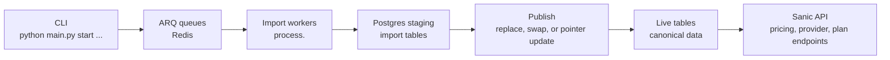

# Architecture

`healthcare-mrf-api` combines command-line import orchestration, ARQ workers,
PostgreSQL staging and live tables, and a Sanic API.

Most long-running imports enqueue work through ARQ, drain records with a worker,
then publish validated staging tables into live names. Some smaller importers
load directly. Publish style is importer-specific: direct replace, `_old`
rollback swap, or snapshot pointer update. Treat `_old` tables as intentional
only when the importer runbook documents that rollback model.

For importer commands, see [imports/README.md](./imports/README.md). For source
ownership, see [data-sources.md](./data-sources.md). For deeper design notes,
start with [../specs/base_arch_prompt.md](../specs/base_arch_prompt.md).

## Main Boundaries

- `api/` owns served HTTP contracts and should keep route handlers focused on
  request validation, authorization context, and response shaping.
- `process/` owns import pipelines. Keep discovery, download, parsing, staging,
  publishing, and post-publish materialization as named phases.
- `db/` owns database connectivity and shared schema helpers.
- `support/ptg2_scanner/` owns Rust scanner and address-canonical performance
  code. Keep Rust module splits covered by fmt, clippy, tests, and parity checks.
- `scripts/ci/` owns push-time guards that should remain deterministic and cheap.

## Where New Code Belongs

- Put importer source-specific parsing in the matching `process/` module.
- Put served contract logic in `api/endpoint/` modules and keep shared helpers
  named and tested.
- Put scanner-only parsing/performance work under `support/ptg2_scanner/`.
- Put deterministic CI checks under `scripts/ci/`.
- Avoid growing existing monoliths when a helper can be extracted with focused
  tests first.

## Current Hotspots

The first safe refactor target is the Rust scanner: move cohesive helpers out of
`support/ptg2_scanner/src/main.rs` into focused modules while preserving current
fmt/clippy/test/build coverage. Large Python DB/API/import files should be split
only after narrower tests are in place.
