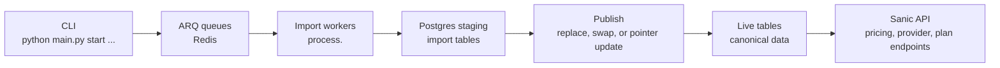

# Architecture

`healthcare-mrf-api` combines command-line import orchestration, ARQ workers,
PostgreSQL staging and live tables, and a Sanic API.

Most long-running imports enqueue work through ARQ, drain records with a worker,
then publish validated staging tables into live names. Some smaller importers
load directly. Publish style is importer-specific: direct replace, `_old`
rollback swap, or snapshot pointer update. Treat `_old` tables as intentional
only when the importer runbook documents that rollback model.

For importer commands, see [imports/README.md](./imports/README.md). For source
ownership, see [data-sources.md](./data-sources.md). For deeper design notes,
start with [../specs/base_arch_prompt.md](../specs/base_arch_prompt.md).
